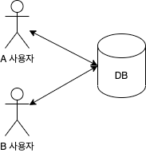

# 동시성 이슈를 해결하는 방법

## Race Condition
공유 자원에 여러 스레드가 동시에 접근할 때, 결과값에 영향을 줄 수 있는 상태를 경쟁상태(Race Condition)라고 합니다.


예를들어 DB에서 A, B사용자가 동시에 리소스에 접근한뒤 동시에 업데이트 한다면? DB에 최종값은 과연 무엇일까요?



```sql
// 재고 테이블에서 수량을 조회
select quantity from stock
```

A, B사용자가 동시에 조회쿼리를 실행하고 같은 결과를 받았다고 가정했을 때, 비즈니스 로직을 실행하고 DB에 결과를 저장하려고 하는데
과연 데이터의 무결성이 유지가 될까? 개발을 진행하며 이러한 부분을 고려하지 않는다면 예상하지 못한 결과를 얻을 것입니다. 
